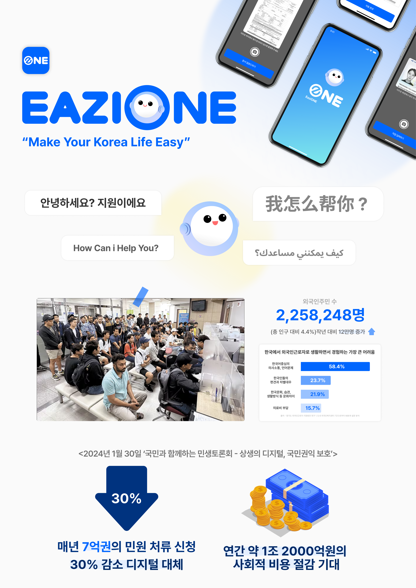
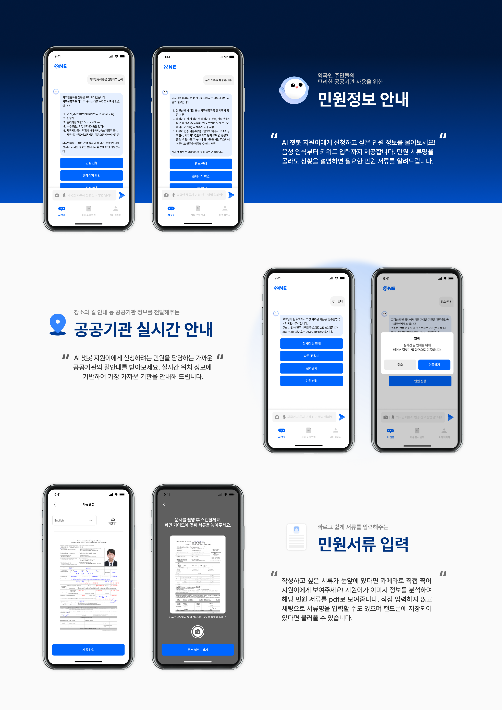
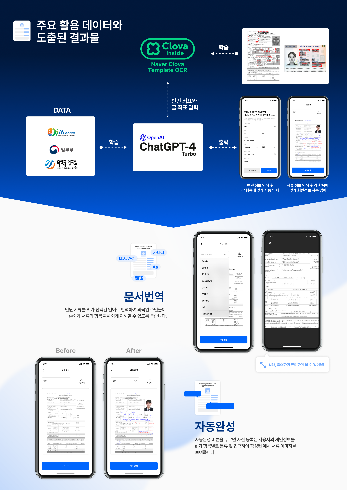
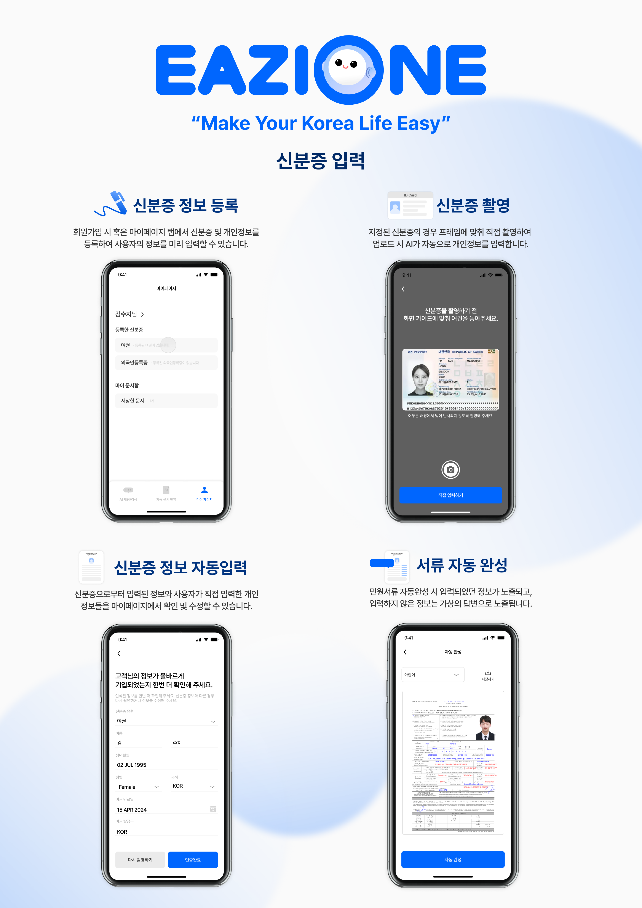

   
  <h2>외국인 노동자들의 민원 서류 자동 번역 및 완성 AI 서비스</h2>

🌱 생성형 AI를 활용한 약자와의 동행 - 새싹 해커톤 🌱

 

 

## 👨🏻‍💻 개발 팀 소개

|     |              |       |
| :-------------------------------------------------------: | :-------------------------------------------------------------------------: | :-----------------------------------------------------------: |
| [이승현 @hyun812](https://github.com/hyun812) `FE` | [전수민 @dalcheonroadhead](https://github.com/dalcheonroadhead) `BE` | [차성원 @Henry-Cha](https://github.com/Henry-Cha) `BE` |
